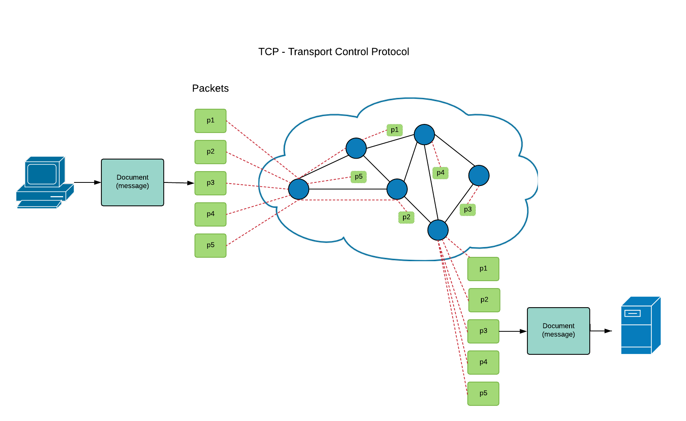
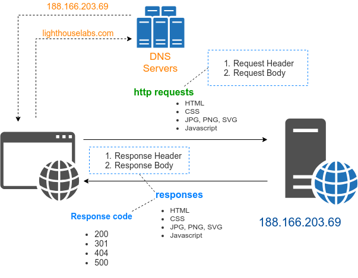
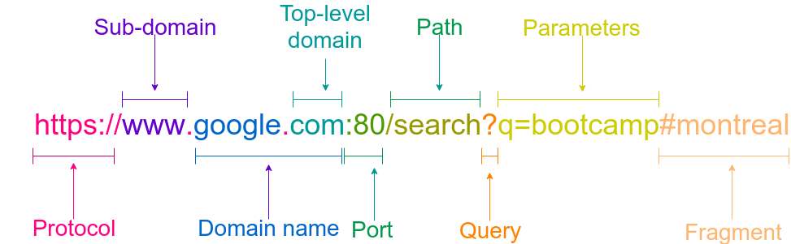

# Networking with TCP and HTTP

## Content

- What is networking? (Quick review)
- TCP introduction (and demo)
- HTTP Fundamentals
- Its request & response nature
- How it leverages TCP
- Most important parts of a request
- Common status codes such as 200, 302, 404, and 500
- Simple node HTTP Client example (using request)


## TCP

#### TCP

- Transmisson Control Protocol
- Messages are broken down into packets and travel over the network to be reassemble



- Messages are broken down into packets
- Messages contained source and destination address in their header
- Each packet travels through the network independantly
- Packets are reassemble into a full message when reaching destination

#### IP

- Internet Protocol
- Address that identifies a computer on the network
- Format xxx.xxx.xxx.xxx

`ping lighthouselabs.com`

### TCP Demo

- Well create a small chat app with the `net` api of node.

### Protocols on Top of TCP/IP

Languages that computers program use to communicate with one another (usually over a network)

| Protocol    | Description                                   |
| :---------- | :-------------------------------------------- |
| http        | Browse Web pages                              |
| https       | Browse Web page with encrypted communication  |
| smtp        | Send and receive emails                       |
| imap, pop 3 | Load emails from an inbox                     |
| irc         | Text based chat                               |
| ftp         | File transfers                                |
| ssh         | Secure socket shell with encrypted connection |
| ssl         | low-level secure data transfer used by https  |

- each of these protocols use a default port

| Protocol   | Default port |
| :--------- | :----------- |
| http       | 80           |
| https      | 443          |
| ssh        | 22           |
| postgreslq | 5432         |
| mongodb    | 27017        |

### Client Server Communication

- A client initiates a connection to a server
- Client asks for a resource
- Server sends back a response with the corresponding resource



#### Other Type of Communication

- Peer-to-peer: clients establish connections directly to other connections with no central server
- bittorrent

## The Web

- What's happening when I type an address in a browser

### URL

- Uniform Resource Locator
- Anatomy of an URL



### http Protocol

- hypertext transfer protocol
- how a web browser (client) communications with a web server (server)
- The client initiates a request and the server sends back a response


[List of http status codes](https://en.wikipedia.org/wiki/List_of_HTTP_status_codes)

#### http verbs

- http requests begin with a verb

(CRUD)

Create
Read
Update
Delete

1. **`Get`** - get a resource (Read)
2. **`Post`** - send a resource (Create)
3. **`Put`** - Update a resource (Update)
4. **`Delete`** - delete a resource (Delete)

- http requests and response both have a _header_ and a _body_

#### http Headers

- Headers use key value pairs

`key: value`

##### Request Headers

```
GET /www.google.com/search?q=bootcamp HTTP/1.1
Host: www.google.com
Accept: text/html,application/xhtml+xml,application/xml;q=0.9,*/*;q=0.8
Accept-Language: en-us,en;q=0.5
Accept-Encoding: gzip,deflate
Accept-Charset: ISO-8859-1,utf-8;q=0.7,*;q=0.7
Keep-Alive: 300
Connection: keep-alive
Cookie: USERID=r2t5uvjq435r4q7ib3vtdjq120
Pragma: no-cache
Cache-Control: no-cache
Cookies: key:value string
user-agent: Mozilla/5.0 (X11; Linux x86_64) AppleWebKit/537.36 (KHTML, like Gecko) Chrome/71.0.3578.98 Safari/537.36
```

##### Post Request - Headers + Body

```
PUT /www.lighthouselabs.com/register HTTP/1.1
Host: www.google.com
Accept: text/html,application/xhtml+xml,application/xml;q=0.9,*/*;q=0.8
Accept-Language: en-us,en;q=0.5
Accept-Encoding: gzip,deflate
Accept-Charset: ISO-8859-1,utf-8;q=0.7,*;q=0.7
Keep-Alive: 300
Connection: keep-alive
Cookie: USERID=r2t5uvjq435r4q7ib3vtdjq120
Pragma: no-cache
Cache-Control: no-cache
Cookies: key:value string
user-agent: Mozilla/5.0 (X11; Linux x86_64) AppleWebKit/537.36 (KHTML, like Gecko) Chrome/71.0.3578.98 Safari/537.36
Content-Type: application/json

{
  "first_name": "Bob",
  "last_name": "Squarepants",
  "email": "spongebob@squarepant.com",
}
```

##### Response

```
cf-ray: 498512599e9bab66-YYZ
content-encoding: br
content-type: text/html
date: Sun, 13 Jan 2019 04:20:40 GMT
expect-ct: max-age=604800, report-uri="https://report-uri.cloudflare.com/cdn-cgi/beacon/expect-ct"
last-modified: Thu, 10 Jan 2019 21:35:48 GMT
server: cloudflare
status: 200

<!DOCTYPE html>
<html>
  <head>
    <title>Canada&#39;s Leading Coding Bootcamp - Lighthouse Labs</title>
    <style>
  @font-face{
  	font-family: 'proxima-nova';
  	font-weight: normal;
  	font-style: normal;
...
```

##### Curl

- Curl to get HTML page

`curl https://www.lighthouselabs.ca`

- To get only the request headers:

`curl -I https://www.lighthouselabs.ca`

```
HTTP/1.1 200 OK
Date: Sun, 13 Jan 2019 17:18:50 GMT
Content-Type: text/html
Connection: keep-alive
Set-Cookie: __cfduid=d0133a361d013d048eba721fe79b64df51547399930; expires=Mon, 13-Jan-20 17:18:50 GMT; path=/; domain=.lighthouselabs.ca; HttpOnly
Last-Modified: Thu, 10 Jan 2019 21:35:48 GMT
Expect-CT: max-age=604800, report-uri="https://report-uri.cloudflare.com/cdn-cgi/beacon/expect-ct"
Server: cloudflare
CF-RAY: 4989863fde7fab90-YYZ
```

### Demo with the request package

- we'll use the request package to query an API

## References

- [TCP](https://www.javatpoint.com/computer-network-tcp-ip-model)
